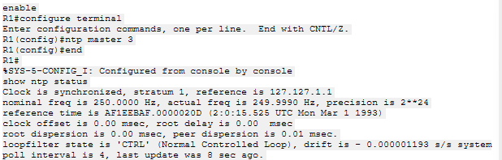
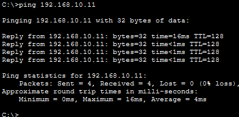
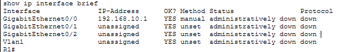
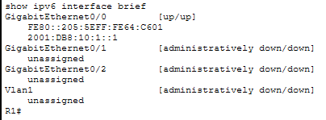

# Cisco Network Administration & Troubleshooting Lab

A practical Cisco Packet Tracer lab focused on **IPv6, secure device management, time synchronization, EtherChannel, and structured network troubleshooting**.

The project combines configuration, verification, fault isolation, and recovery rather than only demonstrating initial connectivity.

## 🎯 Project Highlights

- Configured and verified **IPv6 addressing and connectivity**
- Implemented **SSH v2** for secure remote device management
- Configured **NTP** with R1 as the master clock and SW1/SW2 as clients
- Built and verified **LACP EtherChannel** between switches
- Used Cisco IOS verification commands to identify interface, VLAN, trunk, and routing faults
- Simulated real network faults, observed connectivity impact, identified root causes, and restored service
- Preserved the working **Cisco Packet Tracer (.pkt)** topology for reproduction

## 🏗️ Lab Topology

**Devices**
- 1 Cisco router — R1
- 2 Cisco switches — SW1, SW2
- 2 end hosts — PC0, PC1

**Key connections**
- R1 → switching network
- SW1 ↔ SW2 using **LACP EtherChannel**
- PC0 / PC1 connected to the switching network

**IPv4 addressing**
| Device | Interface | Address |
|---|---|---|
| R1 | Gi0/0 | 192.168.10.1/24 |
| SW1 | VLAN 10 SVI | 192.168.10.2/24 |
| SW2 | VLAN 10 SVI | 192.168.10.3/24 |
| PC1 | NIC | 192.168.10.11/24 |

**IPv6**
- R1 Gi0/0: `2001:DB8:10:1::1/64`

## 🔧 Technologies & Skills

| Area | Implementation |
|---|---|
| IPv6 | IPv6 addressing, IPv6 routing support, connectivity verification |
| Secure Management | SSH v2, local authentication, RSA keys, VTY access control |
| Switching | VLANs, 802.1Q trunking, LACP EtherChannel |
| Network Services | NTP master/client synchronization |
| Troubleshooting | Ping testing, interface status, VLAN checks, trunk checks, EtherChannel verification |
| Cisco IOS | `show` commands, configuration verification, fault isolation and recovery |

## 🛠️ Troubleshooting Scenarios

### 1. Wrong VLAN Assignment
A switch access port was intentionally placed in the wrong VLAN to create a connectivity failure.

**Troubleshooting approach**
1. Test connectivity and observe packet loss.
2. Check VLAN membership and access-port configuration.
3. Identify the incorrect VLAN assignment.
4. Restore the correct VLAN.
5. Re-test connectivity.

**Result:** Connectivity was restored after correcting the VLAN assignment.

### 2. EtherChannel / Trunk Fault
One LACP EtherChannel member was intentionally taken offline.

**Verification**
- EtherChannel status showed one member down while the port-channel remained operational.
- Trunk status was checked with `show interfaces trunk`.
- Connectivity was tested during the fault and after recovery.

**Result:** The failed member was restored and the EtherChannel returned to a healthy state.

### 3. Router Interface Fault
R1 Gi0/0 was intentionally shut down to simulate a router-side connectivity failure.

**Troubleshooting approach**
1. Test connectivity to the router.
2. Check `show ip interface brief`.
3. Identify the administratively down interface.
4. Restore the interface.
5. Re-test connectivity.

**Result:** Connectivity returned after Gi0/0 was restored.

## ⏱️ NTP Verification

R1 operates as the NTP master and SW1/SW2 synchronize against R1.

- R1: **Stratum 1**, synchronized to its local reference
- SW1: synchronized to **192.168.10.1**
- SW2: synchronized to **192.168.10.1**

This demonstrates practical centralized time synchronization across network devices.

## 🔐 SSH Verification

SSH v2 was configured for secure remote management on R1, SW1, and SW2.

Configuration includes:
- Local administrator authentication
- Domain name configuration
- RSA key generation
- SSH version 2
- VTY local login
- SSH-only VTY transport

A successful PC0 → R1 SSH login was verified in Packet Tracer.

## 📊 Verification Evidence

### IPv6 Connectivity

### Secure Remote Management

### NTP Synchronization

### Troubleshooting Evidence

<strong>Additional verification screenshots</strong>

### IPv6 Interface Status

### EtherChannel Connectivity Loss

### Trunk Status

### Router Connectivity Loss

## 📁 Project Files

- **Cisco Network Administration & Troubleshooting Lab.pkt** — complete Cisco Packet Tracer project
- **PNG evidence files** — configuration, verification, fault-isolation, and recovery screenshots

## ▶️ How to Use

1. Download the `.pkt` file from this repository.
2. Open it with Cisco Packet Tracer.
3. Inspect the topology and device configurations.
4. Use the verification screenshots as reference.
5. Reproduce the troubleshooting scenarios if desired.

## 💡 What This Project Demonstrates

This lab is designed around the workflow used in practical network administration:

**Configure → Verify → Test → Isolate the fault → Fix → Re-test**

It demonstrates not only Cisco configuration knowledge, but also the ability to use network evidence and IOS diagnostics to troubleshoot connectivity problems systematically.

---

**Tools:** Cisco Packet Tracer · Cisco IOS · IPv4/IPv6 · SSH · NTP · LACP EtherChannel · Network Troubleshooting
