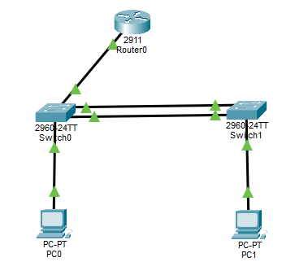
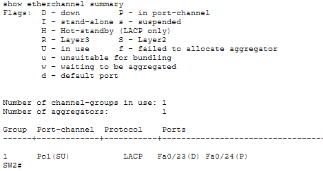
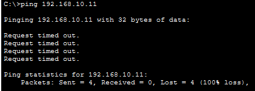
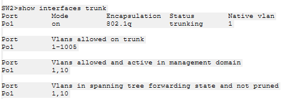
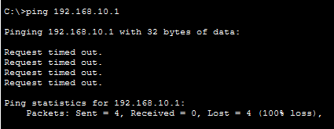
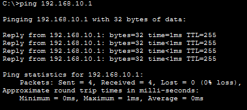
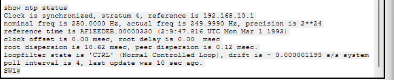
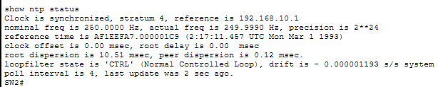
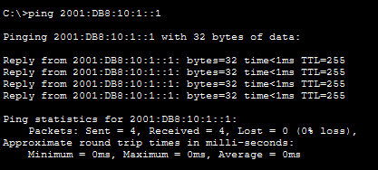
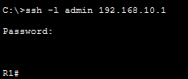

# Cisco Network Administration & Troubleshooting Lab

A practical Cisco Packet Tracer lab focused on **IPv6, secure device management, time synchronization, EtherChannel, and structured network troubleshooting**.

The project follows a practical network-administration workflow: **configure → verify → introduce a fault → isolate the cause → restore service → re-test**.

## 🎯 Project Highlights

- Configured and verified **IPv6 addressing and connectivity**
- Implemented **SSH v2** for secure remote device management
- Configured **NTP** with R1 as the master clock and SW1/SW2 as clients
- Built and verified **LACP EtherChannel** between switches
- Used Cisco IOS verification commands for interface, VLAN, trunk, and EtherChannel troubleshooting
- Simulated three realistic network faults and documented their investigation, resolution, and recovery
- Preserved the complete **Cisco Packet Tracer (.pkt)** topology for reproduction

## 🏗️ Lab Topology

**Devices**
- 1 Cisco router — R1
- 2 Cisco switches — SW1, SW2
- 2 end hosts — PC0, PC1

**Key connections**
- R1 → switching network
- SW1 ↔ SW2 using **LACP EtherChannel**
- PC0 / PC1 connected to the switching network

**IPv4 addressing**

| Device | Interface | Address |
|---|---|---|
| R1 | Gi0/0 | 192.168.10.1/24 |
| SW1 | VLAN 10 SVI | 192.168.10.2/24 |
| SW2 | VLAN 10 SVI | 192.168.10.3/24 |
| PC1 | NIC | 192.168.10.11/24 |

**IPv6**
- R1 Gi0/0: `2001:DB8:10:1::1/64`

## 🔧 Technologies & Skills

| Area | Implementation |
|---|---|
| IPv6 | IPv6 addressing, IPv6 routing support, connectivity verification |
| Secure Management | SSH v2, local authentication, RSA keys, VTY access control |
| Switching | VLANs, 802.1Q trunking, LACP EtherChannel |
| Network Services | NTP master/client synchronization |
| Troubleshooting | Ping testing, VLAN checks, interface status, trunk checks, EtherChannel verification |
| Cisco IOS | `show` commands, configuration verification, fault isolation and recovery |

## 🛠️ Troubleshooting Scenarios

The troubleshooting portion was completed as three deliberate fault-isolation exercises. Each scenario follows the same operational pattern:

**Problem → Investigation → Root Cause → Resolution → Verification**

### Scenario 1 — Wrong VLAN Assignment

**Problem**

An access port was intentionally placed in the wrong VLAN, causing the connected host to lose normal network connectivity.

**Investigation**

1. Tested connectivity and observed packet loss.
2. Checked the switch VLAN/access-port configuration.
3. Identified that the host port was assigned to the incorrect VLAN.

**Resolution**

The access port was returned to the correct VLAN.

**Verification**

Connectivity was tested again after the correction and was restored successfully.

**Evidence**

---

### Scenario 2 — EtherChannel Member / Trunk Fault

**Problem**

One member interface of the LACP EtherChannel was intentionally taken offline to simulate a link fault and observe its effect on the network.

**Investigation**

1. Checked the EtherChannel summary and identified the affected member as down.
2. Checked trunk status with `show interfaces trunk`.
3. Tested connectivity while the member link was unavailable.
4. Compared the state before and after restoring the member.

**Resolution**

The affected EtherChannel member interface was restored.

**Verification**

The EtherChannel returned to a healthy state and connectivity was restored.

**Evidence**

**Member fault detected**

**Connectivity during fault**

**Trunk verification**

**Recovery**

---

### Scenario 3 — Router Interface Fault

**Problem**

R1 Gi0/0 was intentionally shut down to simulate a router-side interface failure.

**Investigation**

1. Tested connectivity to the router.
2. Checked `show ip interface brief`.
3. Identified Gi0/0 as administratively down.
4. Confirmed that the interface state explained the connectivity failure.

**Resolution**

R1 Gi0/0 was restored to an operational state.

**Verification**

Connectivity was tested again and returned successfully.

**Evidence**

**Connectivity loss**

**Root cause**

**Recovery**

## ⏱️ NTP Verification

R1 operates as the NTP master and SW1/SW2 synchronize against R1.

- R1: **Stratum 1**, synchronized to its local reference
- SW1: synchronized to **192.168.10.1**
- SW2: synchronized to **192.168.10.1**

This demonstrates centralized time synchronization across the network devices.

## 🌐 IPv6 Verification

IPv6 connectivity was verified from PC0 to R1 using the configured IPv6 address.

R1 interface status was also checked to confirm the configured IPv6 interface.

## 🔐 SSH Verification

SSH v2 was configured for secure remote management on R1, SW1, and SW2.

Configuration includes:
- Local administrator authentication
- Domain name configuration
- RSA key generation
- SSH version 2
- VTY local login
- SSH-only VTY transport

A successful **PC0 → R1 SSH login** was verified in Packet Tracer.

## 📁 Project Files

- **Cisco Network Administration & Troubleshooting Lab.pkt** — complete Cisco Packet Tracer project
- **evidence/** — organized screenshots covering configuration verification, fault isolation, and recovery

## ▶️ How to Use

1. Download the `.pkt` file from this repository.
2. Open it with Cisco Packet Tracer.
3. Inspect the topology and device configurations.
4. Review the evidence screenshots.
5. Reproduce the troubleshooting scenarios if desired.

## 💡 What This Project Demonstrates

This lab demonstrates a practical approach to network administration rather than only initial configuration.

The documented workflow is:

**Configure → Verify → Test → Isolate the fault → Fix → Re-test**

The three troubleshooting scenarios demonstrate the ability to use connectivity tests and Cisco IOS evidence to identify faults at different layers of the network:

- **Scenario 1:** VLAN/access-port configuration
- **Scenario 2:** EtherChannel/trunk connectivity
- **Scenario 3:** Router interface availability

Together with IPv6, SSH, NTP, and LACP EtherChannel, the project demonstrates hands-on Cisco networking, verification, and structured troubleshooting.

---

**Tools:** Cisco Packet Tracer · Cisco IOS · IPv4/IPv6 · SSH · NTP · LACP EtherChannel · Network Troubleshooting
